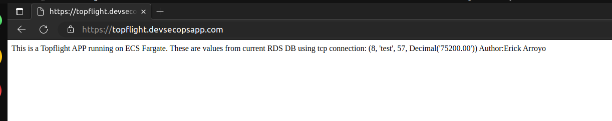
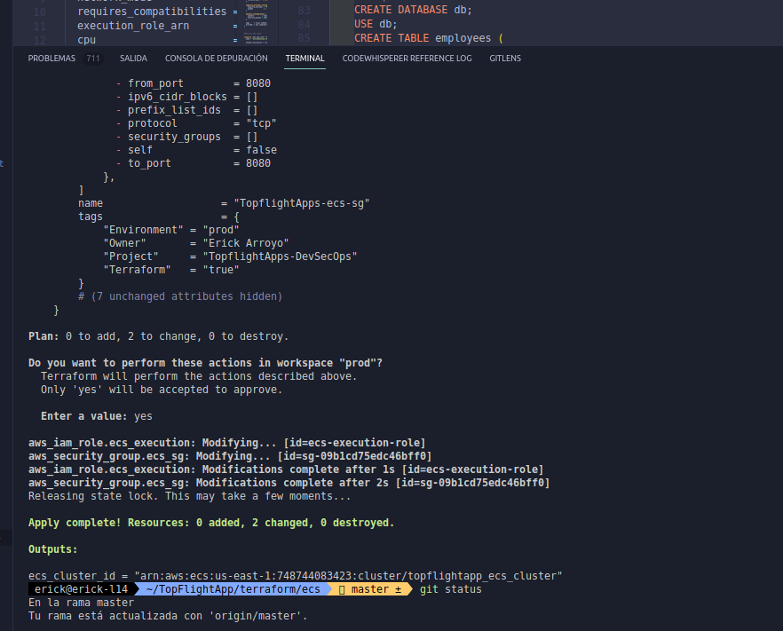

# AWS ECS + RDS secure baseline (Terraform, keyless CI)

A small but complete production-shaped deployment on AWS: VPC, RDS (MySQL 8), a Flask container on ECS Fargate behind an HTTPS ALB, with Terraform state in S3/DynamoDB and a GitHub Actions pipeline that authenticates to AWS through OIDC (no access keys anywhere).

It started in 2023 as a take-home technical assessment. In 2026 I revisited it and hardened it the way I would for a regulated client (fintech/HIPAA). The `git log` shows both: what a working first pass looked like, and what changed once it was reviewed with a security lens.

## What changed in the 2026 hardening

| Area | Before (2023) | After (2026) |
|---|---|---|
| DB credentials | Password passed as a Terraform variable and injected into the ECS task as a plain `environment` value | Generated with `random_password`, stored only in Secrets Manager, injected at task start via `secrets`/`valueFrom`. Never in tfvars, never visible in `describe-task-definition` |
| RDS | MySQL 5.7 (EOL), unencrypted storage, `skip_final_snapshot = true`, no backups, no deletion protection | MySQL 8.0, `storage_encrypted`, 7-day backups, final snapshot, `deletion_protection`, log exports, gp3 |
| Network | ECS ingress open to subnet CIDRs; ECS and RDS egress `0.0.0.0/0` on all ports | ECS ingress from ALB SG only; ECS egress limited to 443 (AWS APIs) and 3306 to the RDS SG; ALB egress only to tasks; RDS has no egress; VPC Flow Logs enabled |
| IAM | Single execution role using deprecated `managed_policy_arns` | Separate execution and task roles, `aws:SourceAccount` condition on trust, secret read scoped to one ARN |
| CI IAM | — | Apply role confined to roles named after the repo; `iam:CreateRole`/`AttachRolePolicy`/`PutRolePolicy` gated on a permissions boundary CI cannot remove or widen; `iam:PassRole` limited to `ecs-tasks` and `ec2`; plan role trusted only for branches and PRs, with a Describe/List policy instead of `ReadOnlyAccess` and secret reads scoped to this application's own prefix |
| TLS | `ELBSecurityPolicy-2016-08` | `ELBSecurityPolicy-TLS13-1-2-2021-06`, `drop_invalid_header_fields` |
| Container | Flask `debug=True`, root user | `debug=False`, non-root user, read-only root filesystem, container insights, 90-day log retention |
| State | Bucket with versioning only, provisioned-capacity lock table | KMS CMK with rotation, public access block, TLS-only bucket policy, on-demand lock table with PITR |
| CI/CD | None | GitHub Actions with OIDC: fmt/validate/trivy on every PR, plan posted as PR comment, guard that fails any plan deleting a stateful resource, apply only from `main` through a protected `prod` environment |
| Supply chain | Unpinned public VPC module | Module and provider versions pinned |
| Misc | Bastion user-data script with hardcoded DB users | Removed |

## Working evidence (2023 deployment)

Screenshots from the original deployment. The 2026 hardening has not been applied to a live account; see PR #1 for what is and isn't verified.

  

  

  

  

  

  

  

  

  

  

  

  

  

  

## Layout

```
terraform/
  backend-remote-state/   # run once, locally: S3 bucket (KMS, versioned, TLS-only) + DynamoDB lock table
  github-oidc/            # run once, locally: OIDC provider + plan role + apply role
  vpc/                    # public/private subnets, single NAT, flow logs
  rds/                    # MySQL 8, secret generation, RDS security group
  ecs/                    # cluster, task definition, service, ALB, IAM roles
env/prod/*.tfvars         # non-secret inputs, versioned on purpose
.github/workflows/terraform.yml
docker/                   # Flask app + Dockerfile
```

Each stack has its own state file and reads upstream outputs with `terraform_remote_state`, so a change to ECS never produces a plan that touches the database.

## How CI authenticates (OIDC)

`terraform/github-oidc` creates two roles:

- `*-gha-plan`: trusted for branches and pull requests of this repo (`:ref:refs/heads/*` and `:pull_request`, listed explicitly so a future environment does not inherit the trust). Describe/Get/List on the services these stacks manage, plus state bucket and lock table access. It can read secret values only under this application's own prefix, which is what a plan needs, rather than account-wide. Used on pull requests.
- `*-gha-apply`: trusted only for `repo:<org>/<repo>:environment:prod`. Scoped write permissions for the services this repo manages (not AdministratorAccess). Role creation is confined to the repo's name prefix and only permitted when the new role carries the workload permissions boundary, which this role cannot detach or widen; `iam:PassRole` is limited to `ecs-tasks.amazonaws.com` and `ec2.amazonaws.com`. Used on push to `main`, and GitHub will not mint that token until the `prod` environment's required reviewers approve.

The workflow requests `id-token: write` and calls `aws-actions/configure-aws-credentials` with the role ARN. There is no `AWS_ACCESS_KEY_ID` in this repository or its secrets.

## Bootstrap (once, locally with an SSO profile)

```bash
export AWS_PROFILE=<your-sso-profile>

cd terraform/backend-remote-state/s3    && terraform init && terraform apply
cd ../dynamo                             && terraform init && terraform apply
cd ../../github-oidc                     && terraform init && terraform apply \
  -var app=<app> -var github_org=<org> -var github_repo=<repo> \
  -var state_bucket=<bucket> -var lock_table=<table>
```

Then in GitHub: create the `prod` environment with required reviewers, set repository variable `AWS_PLAN_ROLE_ARN` and environment variable `AWS_APPLY_ROLE_ARN` from the outputs.

## Deploy order

`vpc` → `rds` → `ecs`. The pipeline enforces it; locally, apply them in that order with `terraform workspace select prod`.

## Next steps I would take for a real client

- VPC endpoints (ecr.api, ecr.dkr, s3, secretsmanager, logs) and drop the 443 egress to the internet
- AWS WAF on the ALB with rate limiting and managed rule groups
- Customer-managed KMS key for RDS and Secrets Manager
- Multi-AZ RDS and one NAT per AZ
- Scan the container image in CI before deploy (the base image is already pinned by digest)
- Scope the CI apply role's service permissions by tag once a tagging convention exists; today `ec2`, `ecs`, `rds` and `secretsmanager` writes are account-wide, bounded only by the IAM restrictions above
- Enable RDS IAM database authentication and drop password auth; the app authenticates with a password by design today
